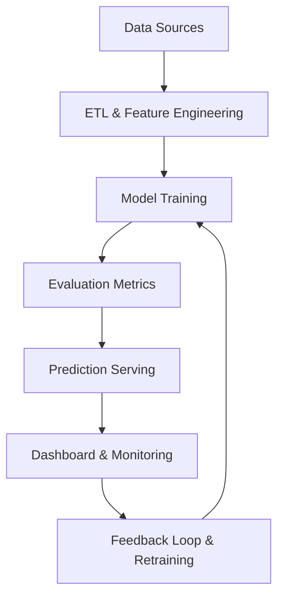

# Smart Demand Forecasting System for Retail Supply Chain

## Problem Statement

A nationwide retail chain wants to optimize inventory operations across hundreds of stores. The solution aims to:

- Minimize stockouts and overstock conditions
- Enhance logistical efficiency and cost planning
- Adapt to seasonal, promotional, and regional factors

## Available Data Sources

### Internal Data
- Daily sales at item-store level
- Store metadata: location, store type, demographics
- Promotions and discounts history

### External Data
- Weather conditions (daily forecast, extremes)
- Holiday and event calendars (regional & national)
- Macroeconomic signals (mobility indices, inflation trends)

## Modeling Paradigm

This is a **Supervised Regression Problem**, where labeled historical demand data is used to predict future quantities.

## Model Architecture Options

### Option A: Gradient Boosting Models (XGBoost / LightGBM)
- Pros: Accurate on structured data, interpretable, fast training
- Cons: Manual feature engineering needed, limited temporal modeling

### Option B: Deep Temporal Models (LSTM / Temporal Fusion Transformers)
- Pros: Captures seasonality, dependencies across time
- Cons: More complex to train and deploy, lower interpretability

---

## System Workflow Diagram (Mermaid)

