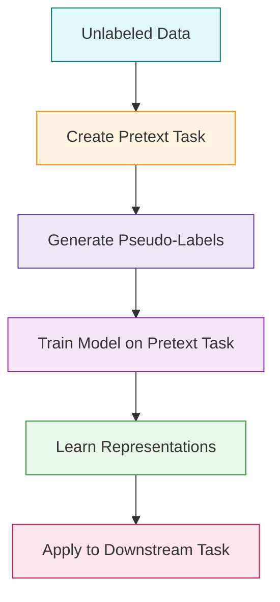

# Self-Supervised Learning: A Modern AI Paradigm

Self-Supervised Learning (SSL) is a powerful machine learning approach where models learn useful representations from unlabeled data by predicting parts of the data from other parts. It sits between supervised and unsupervised learning and is especially vital in domains where labeling data is expensive or impractical.

---

##  Key Concept

Self-supervised learning creates **pseudo-labels** from the input data itself. The model is trained to predict these labels, enabling it to learn meaningful patterns and representations without human-annotated data.

---

##  Why It Matters

- 🚫 Reduces reliance on labeled datasets  
- ⚡ Enables pretraining for downstream tasks  
- 🌍 Unlocks massive unlabeled corpora (e.g., text, images, audio)  
- 🧩 Learns generalizable features useful across tasks

---

##  How It Works

1. **Pretext Task Creation**: Define an auxiliary prediction task using parts of the data.
2. **Model Training**: Train on the pretext task using pseudo-labels.
3. **Representation Extraction**: Use the learned features for downstream tasks like classification or retrieval.

---

## ✨ Example Applications

| Domain     | SSL Strategy               | Example Task                      |
|------------|----------------------------|-----------------------------------|
| NLP        | Masked language modeling   | Predict missing words (e.g., BERT)|
| Vision     | Contrastive learning       | Distinguish augmented images      |
| Speech     | Predictive coding          | Forecast future audio frames      |
| Time Series| Temporal contrast learning | Identify transformations over time|

---

## 🔍 Common Techniques

- **Contrastive Learning**: Compare positive vs. negative pairs to learn invariant features.
- **Masked Prediction**: Hide parts of data and train models to recover them (e.g., transformers).
- **Clustering-Based Pretraining**: Group data into clusters to learn structured representations.

---

##  Popular Models & Frameworks

- **BERT** (NLP)  
- **SimCLR, BYOL** (Computer Vision)  
- **HuBERT, Wav2Vec** (Speech Recognition)  
- **DINO, MAE** (Vision Transformers)

---

##  Suggested Readings

- [A Simple Framework for Contrastive Learning of Visual Representations – SimCLR](https://arxiv.org/abs/2002.05709)  
- [Masked Autoencoders Are Scalable Vision Learners – MAE](https://arxiv.org/abs/2111.06377)  
- [BERT: Pre-training of Deep Bidirectional Transformers](https://arxiv.org/abs/1810.04805)

---


## Self-Supervised Learning Workflow



## Workflow for Wildlife Detection

```mermaid
flowchart TD
    A[Raw Drone Footage (Unlabeled)] --> B[Create Pretext Task<br/>e.g., Predict Image Patch from Surrounding Pixels]
    B --> C[Generate Pseudo-Labels]
    C --> D[Train CNN on Pretext Task<br/>(e.g., masked patch prediction)]
    D --> E[Learn Image Representations]
    E --> F[Transfer Learned Features to Downstream Task<br/>(Wildlife Classification)]
    F --> G[Deploy on Edge Devices for Real-Time Detection]
    
    style A fill:#e3f2fd,stroke:#2196f3
    style B fill:#fff3e0,stroke:#ff9800
    style C fill:#ede7f6,stroke:#673ab7
    style D fill:#f3e5f5,stroke:#9c27b0
    style E fill:#e8f5e9,stroke:#4caf50
    style F fill:#fce4ec,stroke:#e91e63
    style G fill:#ede7f6,stroke:#3f51b5
```

